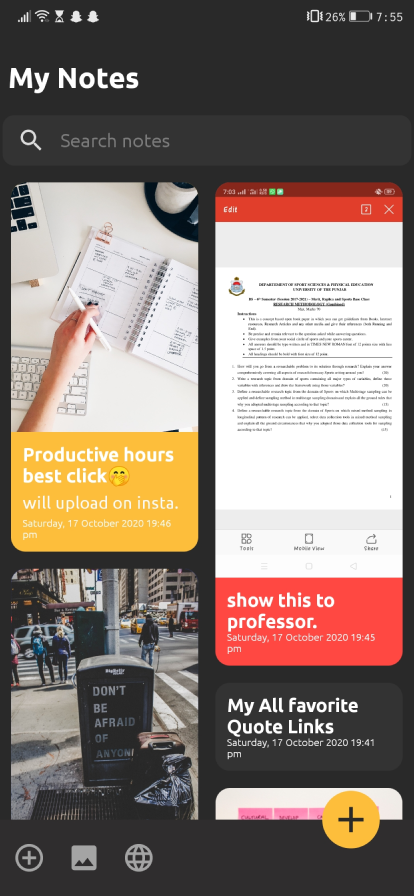
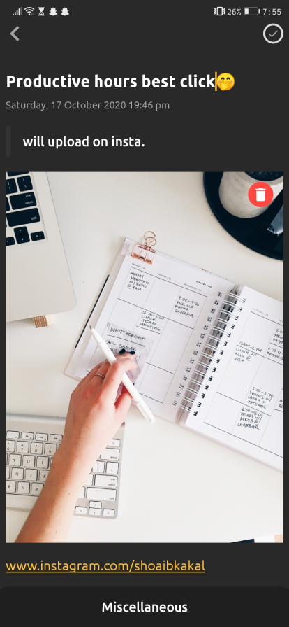
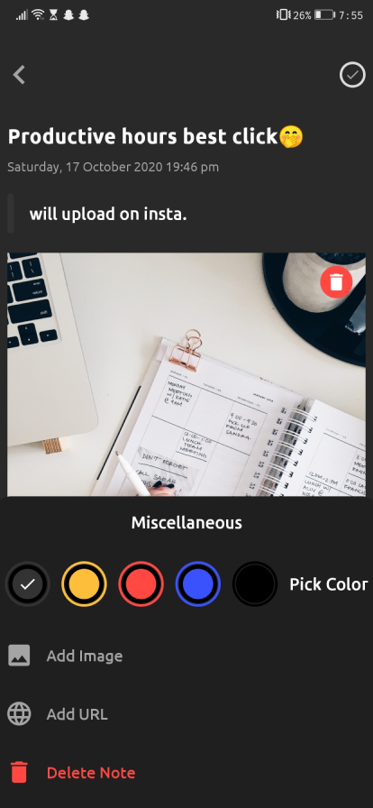

# NotesApp
**This application is to boost up your productivity level and as a developer, it will clear your many concepts regarding Android.** 

 

  

  ## Concepts Covered
  
  - StaggeredGridLayoutManager
  - Shimmer Effect
  - Room Database
  
  # Contributors

Thanks goes to these wonderful people:
<!-- ALL-CONTRIBUTORS-LIST:START - Do not remove or modify this section -->
<!-- prettier-ignore -->

<table>
  <tr>
      
  <td align="center"><a href="https://github.com/shoaibkakal"> <b>Shoaib Kakal</b></a> </td>
  
  </tr>
</table>
  
